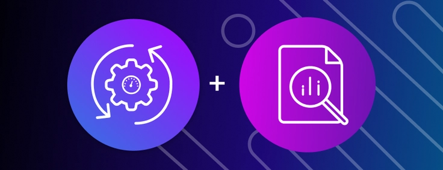
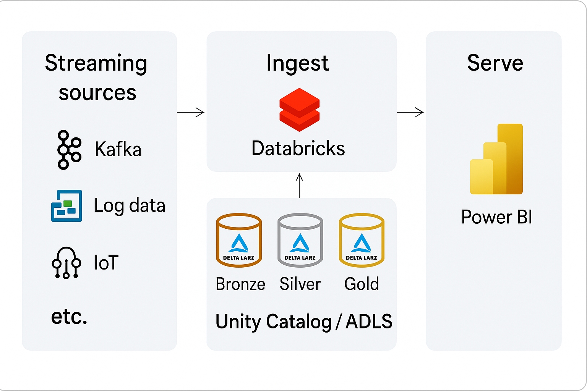

## Visão Geral
Pipeline de streaming em tempo real de dados simulados (JSON), enviados para o Azure Event Hub, processados com Databricks (Structured Streaming) e gravados no SQL Server para consumo por um dashboard em Power BI.
## Objetivos
- Processamento e entrega de dados em tempo real.
## Tecnologias
- Python: geração de dados
- Azure Event Hub: ingestão de dados
- Databricks: processamento em streaming
- SQL Server: armazenamento
- Power BI: dashboard
## Arquitetura
1. Geração de Dados Simulados
   - Tecnologia: script Python
   - Formato dos Dados: JSON
   - Descrição: Gera eventos contínuos (e.g., sensores, cliques, logs) e envia para o Azure Event Hub.

2. Ingestão com Azure Event Hub
   - Serviço: Azure Event Hub (Standard Tier)
   - Função: Recebe eventos em tempo real e os armazena temporariamente para consumo por múltiplos consumidores.
   - Formato de ingestão: JSON

3. Processamento com Databricks
   - Tecnologia: Databricks com Apache Spark (Structured Streaming)
   - Função:
     - Leitura dos eventos do Azure Event Hub
     - Parsing do JSON
     - Transformações/limpezas/validações
     - Agregações em janelas (opcional)
   - Output: DataFrame estruturado pronto para persistência

4. Persistência em Banco de Dados
   - Destino: SQL Server (Azure SQL ou VM com SQL Server)
   - Método: writeStream.foreachBatch gravando via JDBC
   - Formato: tabelas relacionais com esquema definido

5. Camada de Visualização
   - Ferramenta: Power BI
   - Modo de Acesso: Import ou DirectQuery ao SQL Server
   - Finalidade: visualização em tempo quase real dos dados processados.

## Documentações Utilizadas
https://learn.microsoft.com/en-us/azure/event-hubs/event-hubs-create
#
#
#

## Overview
Real-time streaming pipeline of simulated data (JSON), sent to Azure Event Hub, processed with Databricks (Structured Streaming) and written to SQL Server for consumption by a Power BI dashboard.
## Objectives
- Real-time data processing and delivery.
## Technologies
- Python: data generation
- Azure Event Hub: data ingestion
- Databricks: streaming processing
- SQL Server: storaging
- Power BI: dashboard
## Architecture
1. Simulated Data Generation
   - Technology: Python script
   - Data Format: JSON
   - Description: Generates continuous events (e.g., sensors, clicks, logs) and sends them to Azure Event Hub.

2. Ingestion with Azure Event Hub
   - Service: Azure Event Hub (Standard Tier)
   - Function: Receives events in real-time and stores them temporarily for consumption by multiple consumers.
   - Ingestion Format: JSON

3. Processing with Databricks
   - Technology: Databricks with Apache Spark (Structured Streaming)
   - Function:
     - Reading Azure Event Hub events
     - JSON parsing
     - Transformations/cleanings/validations
     - Windowed aggregations (optional)
   - Output: structured DataFrame ready for persistence

4. Database Persistence
   - Target: SQL Server (Azure SQL or VM with SQL Server)
   - Method: writeStream.foreachBatch writing for JDBC
   - Format: relational tables with defined schema

5. View Layer
   - Tool: Power BI
   - Access Mode: Import or DirectQuery to SQL Server
   - Purpose: real-time visualization of processed data.

## Documentation Used
https://learn.microsoft.com/en-us/azure/event-hubs/event-hubs-create
