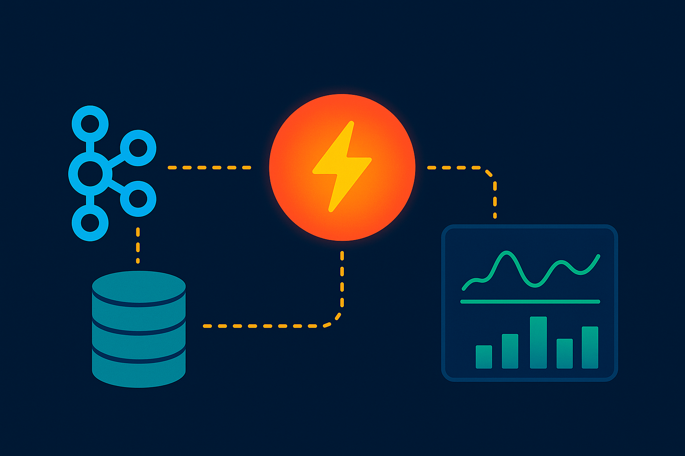
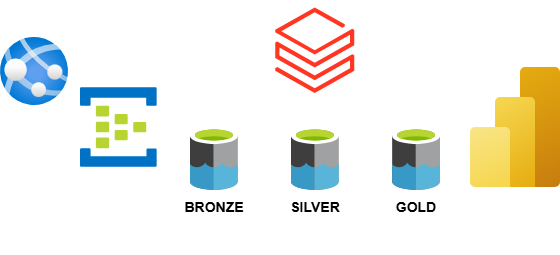

# Processamento de Eventos em Tempo Real

## Visão Geral
Pipeline de streaming em tempo real de dados simulados (JSON), enviados para Azure Event Hub, processados com Databricks (Structured Streaming) e gravados no SQL Server para consumo por um dashboard em Power BI.
## Objetivos
- Processamento e entrega de dados em tempo real
## Tecnologias
- Python/PySpark: geração de dados
- Azure Event Hub: ingestão
- Azure Databricks: processamento em streaming
- SQL Server: armazenamento
- Power BI: dashboard
## Arquitetura
Arquitetura do Pipeline de Streaming em Tempo Real

1. Geração de Dados Simulados
   - Tecnologia: Script Python (ou app em .NET/Node.js)
   - Formato dos Dados: JSON
   - Descrição: Gera eventos contínuos (e.g., sensores, cliques, logs) e envia para o Azure Event Hub.

2. Ingestão com Azure Event Hub
   - Serviço: Azure Event Hub (Standard Tier)
   - Função: Recebe eventos em tempo real e os armazena temporariamente para consumo por múltiplos consumidores.
   - Formato de ingestão: JSON

3. Processamento com Azure Databricks
   - Tecnologia: Databricks com Apache Spark (Structured Streaming)
   - Função:
     - Leitura dos eventos do Event Hub
     - Parsing do JSON
     - Transformações/limpezas/validações
     - Agregações em janelas (opcional)
   - Output: DataFrame estruturado pronto para persistência

4. Persistência em Banco de Dados
   - Destino: SQL Server (Azure SQL ou VM com SQL Server)
   - Método: writeStream.foreachBatch gravando via JDBC
   - Formato: Tabelas relacionais com esquema definido

5. Camada de Visualização
   - Ferramenta: Power BI
   - Modo de Acesso: Import ou DirectQuery ao SQL Server
   - Finalidade: Visualização em tempo quase real dos dados processados

#
#
#
# Real Time Event Processing

